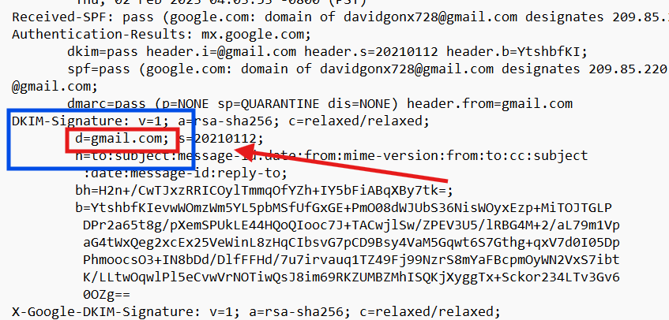
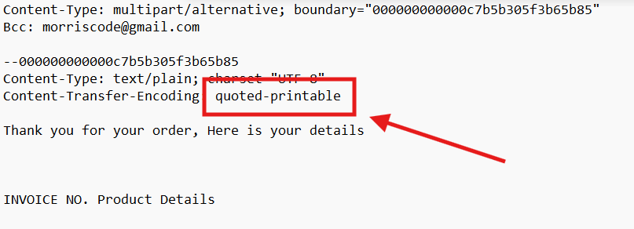

# CTF Challenge – Email Analysis 02

**File:** [email01.eml](./email02.eml)\
**Category:** Phishing / Invoice Scam / URL Analysis

## Questions

1. **DKIM Signing Domain**\
   What domain is used in the DKIM signature?\
   *Answer format:* domain only (e.g., example.com)

2. **SPF Result**\
   What is the SPF authentication result?\

3. **Social Engineering Cue**\
   Identify the phrase that creates a sense of urgency for reimbursement.\
   *Answer format:* exact phrase (up to 25 words)

4. **Encoding Anomaly**\
   Which MIME encoding allows non-ASCII characters in the HTML part?\
   *Answer format:* encoding name (lowercase)

---

## Writeup and Solutions

Below is the detailed analysis for each question, demonstrating how a SOC analyst would extract and interpret the required information from the `email02.eml` file.

### Q1: DKIM Signing Domain

To verify the authenticity of the sender, examine the `DKIM-Signature` header near the top of the email. The domain is specified by the `d=` tag within that header. In this case, you will find:

```
DKIM-Signature: ... d=gmail.com;
```

This indicates the message was signed by `gmail.com`.

**Answer:** `gmail.com`



---

### Q2: SPF Result

Next, check the SPF authentication outcome by locating the `Received-SPF` or `Authentication-Results` header. The header reads:

```
Received-SPF: pass (google.com: domain of davidgonx728@gmail.com designates 209.85.220.41 as permitted sender)
```

The keyword `pass` shows that the sending IP was authorized in the domain’s SPF record.

**Answer:** `pass`


---

### Q3: Social Engineering Cue

Phishing attempts frequently employ urgent language to push recipients to act without thinking. Read the plain-text section and locate the sentence offering reimbursement if the subscription is not continued:

```
If you wish to not to continue subscription and claim a REIMBURSE then please feel free to call our Billing Dept. as soon as possible.
```

This phrase pressures the recipient to call immediately.

**Answer:** `If you wish to not to continue subscription and claim a REIMBURSE then please feel free to call our Billing Dept. as soon as possible.`


---

### Q4: Encoding Anomaly

Non-ASCII characters are included in the HTML section using the `Content-Transfer-Encoding` header. Inspect the HTML part and find:

```
Content-Transfer-Encoding: quoted-printable
```

This encoding allows characters like `=C2=A0` to represent non-breaking spaces in the HTML.

**Answer:** `quoted-printable`

