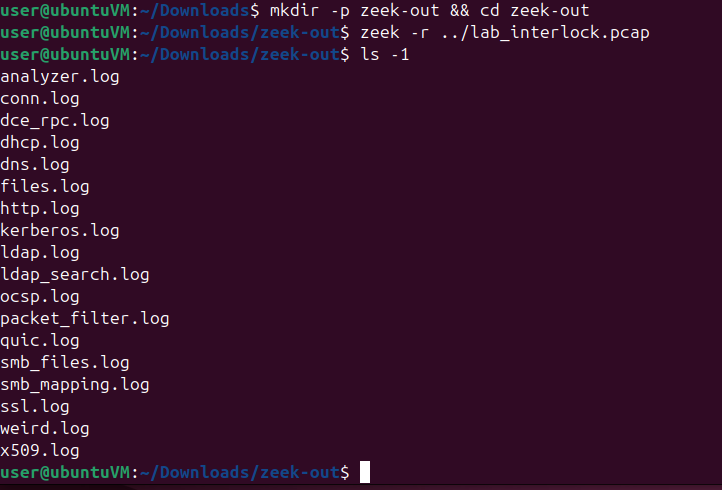
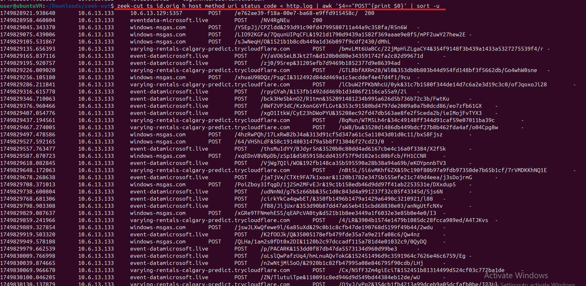
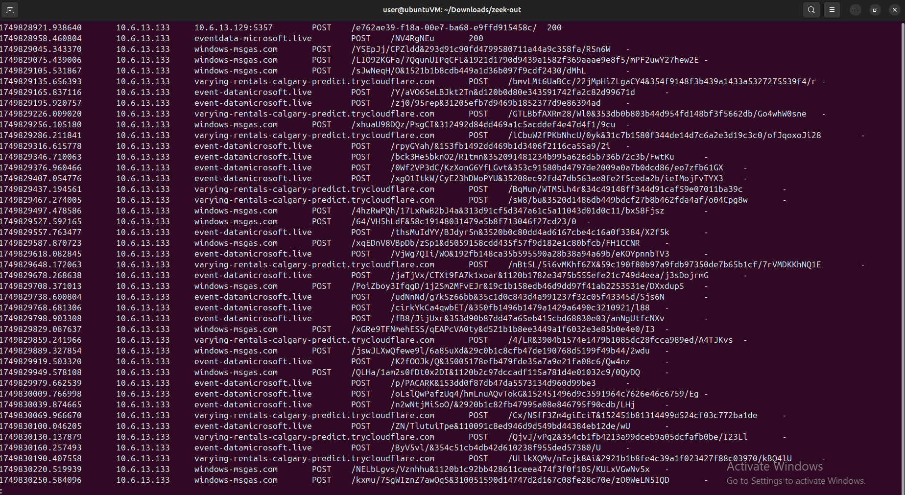

# Zeek Lab — Investigating a malicious pcap

---

## Objectives

- Run Zeek over [this pcap](./lab_interlock.pcap) and inspect Zeek logs.
- Extract DNS, HTTP and TLS indicators with `zeek-cut`.
- Identify suspicious HTTP POSTs and TLS SNI values.
- Implement a tiny Zeek detection script that raises Notices for known malicious domains.

---

## Setup — what to do and why

Run Zeek on the pcap to generate Zeek logs in the current directory. The logs (dns.log, http.log, ssl.log) are the data sources for the lab.

```bash
mkdir -p zeek-out && cd zeek-out
zeek -r ../lab_interlock.pcap
ls -1
```


---

## Task 1 — inspect core logs

Get a quick view of DNS queries, sample HTTP entries, and sample TLS SNI values if present.

```bash
zeek-cut id.orig_h query rcode_name < dns.log | head -n 10
zeek-cut ts id.orig_h host method uri status_code < http.log | head -n 15
ls tls.log ssl.log 2>/dev/null || true
[ -f tls.log ] && zeek-cut ts id.orig_h id.resp_h server_name < tls.log | head
[ -f ssl.log ] && zeek-cut ts id.orig_h id.resp_h server_name < ssl.log | head
```

---

## Task 2 — find suspicious HTTP POSTs

Extract HTTP requests where the method is POST; these often indicate data exfiltration or C2 beacons.

```bash
zeek-cut ts id.orig_h host method uri status_code < http.log | awk '$4=="POST"{print $0}' | sort -u
```



---

## Task 3 — inspect TLS SNI for landing pages

List unique TLS server\_name (SNI) values to find hostnames used as landing pages or C2 endpoints.

```bash
if [ -f tls.log ]; then
  zeek-cut ts id.orig_h id.resp_h server_name < tls.log | sort -u | head
elif [ -f ssl.log ]; then
  zeek-cut ts id.orig_h id.resp_h server_name < ssl.log | sort -u | head
else
  echo "No TLS log found"
fi
```


---

## Task 4 — build a CSV of suspicious events

Export HTTP and TLS events into a simple CSV for easy review and reporting.

```bash
(zeek-cut host < http.log 2>/dev/null || true) | sort -u
(zeek-cut server_name < tls.log 2>/dev/null || true) | sort -u
zeek-cut ts id.orig_h host method uri status_code < http.log 2>/dev/null | awk -F"	" 'NR>1{print $1","$2","$3",http"}' > http_events.csv
if [ -f tls.log ]; then
  zeek-cut ts id.orig_h id.resp_h server_name < tls.log | awk -F"	" 'NR>1{print $1","$2","$3",tls"}' > tls_events.csv
fi
( echo "ts,client,domain,proto"; cat http_events.csv tls_events.csv 2>/dev/null ) > suspicious_events.csv
head -n 20 suspicious_events.csv
```


---

## Task 5 — Zeek detection script 

Raise a Notice when HTTP Host or TLS SNI matches a small set of known malicious domains.

**High-level idea:**
- Load HTTP, TLS, and Notice frameworks.
- Keep a list of suspicious domains.
- Watch HTTP host headers and TLS SNI fields for matches.
- Log a Notice when a match is found.

### Script (save as `mal_domains.zeek`)

```zeek
@load base/protocols/http
@load base/protocols/ssl
@load base/frameworks/notice

redef enum Notice::Type += { Suspicious_Domain };

const Suspicious_Domains: set[string] = {
    "windows-msgas.com",
    "eventdata-microsoft.live",
    "event-datamicrosoft.live",
    "event-time-microsoft.org",
    "varying-rentals-calgary-predict.trycloudflare.com",
    "www.truglomedspa.com"
};

function maybe_notice_domain(c: connection, domain: string, proto: string)
{
    if ( domain in Suspicious_Domains )
    {
        NOTICE([
            $note = Suspicious_Domain,
            $msg  = fmt("%s to suspicious domain: %s", proto, domain),
            $conn = c,
            $identifier = fmt("%s/%s/%s", proto, domain, c$id$orig_h)
        ]);
    }
}

event http_request(c: connection, method: string, original_URI: string, unescaped_URI: string, uri: string)
{
    if ( c?$http && c$http?$host )
        maybe_notice_domain(c, c$http$host, "http");
}

event ssl_extension_server_name(c: connection, is_orig: bool, names: string_vec)
{
    if ( is_orig )
    {
        for ( i in names )
        {
            local sni = names[i];
            maybe_notice_domain(c, sni, "tls");
        }
    }
}
```


## Run the detection script and inspect results

Run Zeek with the script to generate notice.log entries for matches.

```bash
zeek -r ../lab_interlock.pcap mal_domains.zeek
cat notice.log
```


---

## Useful review commands

Count frequent NXDOMAIN responses to find noisy/misconfigured names; page through HTTP POSTs for manual review.

```bash
zeek-cut id.orig_h query rcode_name < dns.log | awk '$3=="NXDOMAIN" {print $2}' | sort | uniq -c | sort -rn | head
zeek-cut ts id.orig_h host method uri status_code < http.log | awk '$4=="POST"{print $0}' | sort -u | less
```




---

Check out  [Zeek Lab Results](./zeek_lab_results.md) for a better understaning.